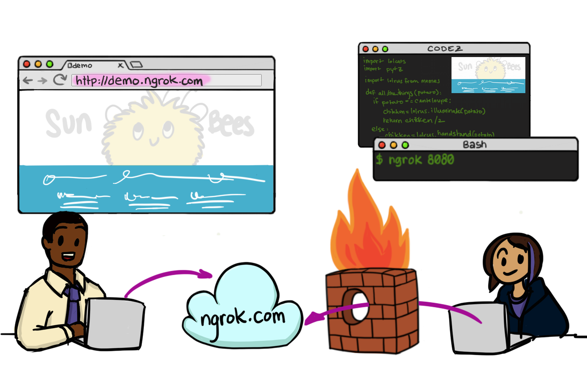
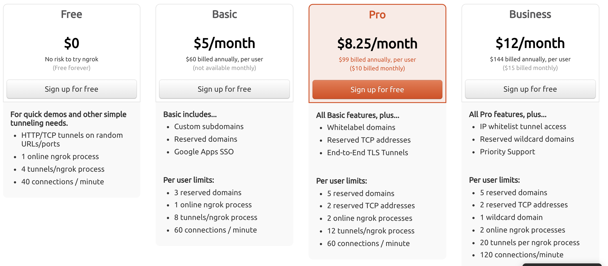
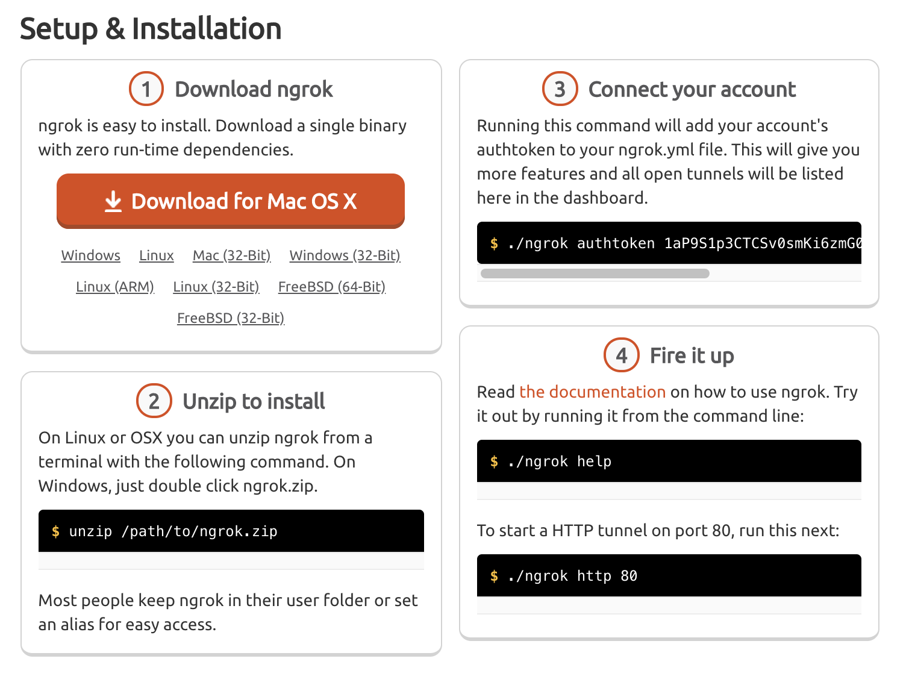
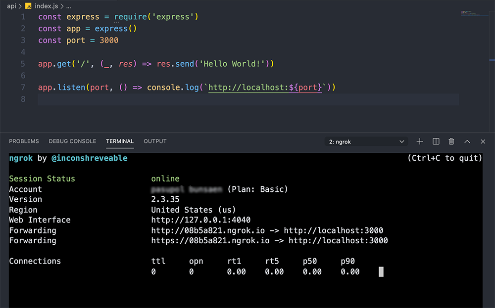
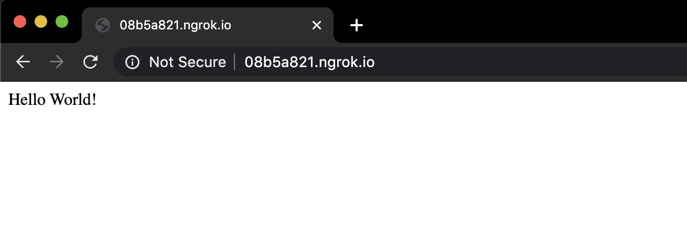

>หลังจากที่ไม่ได้เขียนบทความมานาน วันนี้มีเทคนิคในการทำให้ Web server ที่รันอยู่ใน Local (localhost) สามารถเข้าถึงได้จากภายนอก มาฝากกันครับ

## หลักการทำงาน ของ ngrok

คือ หลังจาก ที่เรา ดาวน์โหลด ngrok มาไว้ในเครื่องแล้ว จากนั้น ให้รัน ngrok ขึ้นมา แล้ว กำหนด port ของ service นั้นๆลงไป อย่างเช่น port 3000
 
จากนั้น ngrok ทำการเชื่อมต่อไปยัง server ที่อยู่บน cloud ซึ่งทำหน้าที่ในการ รับ traffic ที่เข้ามาจาก public ip แล้ว forward มายัง ngrok process ที่รันอยู่บนเครื่องเรา (local) ซึ่งนั้น เป็นเหตุผลว่า ทำไมมันถึงเชื่อมต่อ local service จากภายนอกได้


## ตัวอย่าง ข้อดีของ ngrok
- ใช้ demo เว็บไซต์ หรือ service ต่างๆได้ โดยที่ไม่ต้อง deploy ขึ้น server จริง
- สามารถ กำหนด domain ที่ต้องการได้ (ไม่ฟรี)
- รองรับ websocket
- สามารถ inspect ดู HTTP request และ response ได้
- เร็วส์ เพราะ ngrok tunnels รันอยู่บน HTTP/2

## ข้อแตกต่างของแต่ละ package
ต้องบอกก่อนว่า ngrok มีทั้งแบบที่ ฟรี แล้วก็เสียตังค์นะครับ อ่านเพิ่มเติมได้ที่ <a rel="noreferrer" href="https://ngrok.com/pricing" target="_blank">https://ngrok.com/pricing</a>



## ขั้นตอนการติดตั้ง เพื่อใช้งาน



1. ทำการโหลด ngrok <a href="https://dashboard.ngrok.com/get-started" rel="noreferrer" target="_blank">https://dashboard.ngrok.com/get-started</a> (ต้องสมัครสมาชิกก่อน)

2. หลังจากโหลดเสร็จแล้ว ให้ทำการ unzip

3. ทำการเชื่อมต่อกับ account ของ ngrok โดยใช้คำสั่ง `./ngrok authtoken <token>`

4. ทดสอบการใช้งาน `./ngrok http 3000` (ต้องทำการรัน service ที่ต้องการก่อน)

> * Token จะถูกสร้าง หลังจากที่ สมัครสมาชิกสำเร็จ ดูได้จากหน้า dashboard
> * 3000 คือ port ของ service เรา ที่รันอยู่

ตัวอย่างของ service ง่ายๆ ที่ใช้ในการทดสอบ

``` javascript
const express = require('express')
const app = express()
const port = 3000

app.get('/', (_, res) => res.send('Hello World!'))

app.listen(port, () => console.log(`http://localhost:${port}`))

```

ผลลัพธ์ที่ได้



ลองเข้าผ่าน url ดู



> ซึ่งถ้า package ฟรี url จะ เปลี่ยนใหม่ทุกครั้งที่ รัน ถ้า อยาก custom domain เองต้องซื้อ package Pro หรือ Business

ตอนนี้ลอง ซื้อ package basic เดือนละ 5$ ราวๆ 150 มาลอง ซึ่งสามารถ custom sub-domain ได้ ซึ่งก็ทำให้ เวลารัน domain ที่ได้ก็จะไม่เปลี่ยน เช่นกัน

คำสั่งที่ใช้ในการรัน `./ngrok http -subdomain=www.api-local 3000`

> www.api-local ตรงนี้ ใส่ domain ที่ต้องการ


สำหรับบทความนี้ ก็ขอจบไว้เพียงสั้นๆ แค่นี้ครับ 🙈