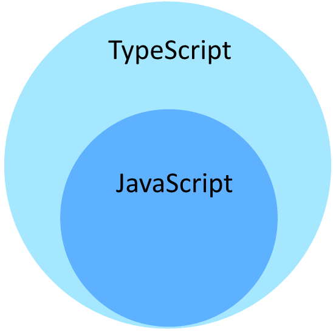

## TypeScript for JavaScript Programmers #1

- [Basic Type](/typescript-for-javascript-programmers-basic-types)
  - [Boolean](/typescript-for-javascript-programmers-basic-types#boolean)
  - [Number](/typescript-for-javascript-programmers-basic-types#number)
  - [String](/typescript-for-javascript-programmers-basic-types#string)
  - [Tuple](/typescript-for-javascript-programmers-basic-types#tuple)
  - [Enum](/typescript-for-javascript-programmers-basic-types#enum)
  - [Unknown](/typescript-for-javascript-programmers-basic-types#unknown)
  - [Any](/typescript-for-javascript-programmers-basic-types#any)
  - [Void](/typescript-for-javascript-programmers-basic-types#void)
  - [Null-กับ-Undefined](/typescript-for-javascript-programmers-basic-types#null-กับ-undefined)
  - [Never](/typescript-for-javascript-programmers-basic-types#never)
  - [Object](/typescript-for-javascript-programmers-basic-types#object)
  - [Type-assertions](/typescript-for-javascript-programmers-basic-types#type-assertions)

อย่างที่รู้กันนะครับว่า TypeScript เป็น SuperSet ของ JavaScript กล่าวคือ TypeScript สามารถใช้ความสามารถ ที่มีของ JavaScript ได้ทั้งหมด พร้อมทั้งยังเพิ่มความสามารถให้กับ JavaScript ได้อีกด้วย โดยสิ่งที่เพิ่มเข้ามาหลักๆเลยคือ Type System ที่จะเข้ามาช่วยในการจัดการเรื่อง Type นั่นเองครับ
<br/>

<div style="max-width:300px;margin:auto">



</div>
<br/>
โดยวันนี้จะพาไปดูกันครับว่า ใน TypeScript นั้นประกอบไปด้วย Type อะไรบ้าง

## Boolean

เริ่มจาก Data Type แบบเบสิคๆ ที่ไว้เก็บค่า True/False กันครับ โดย Type นี้ ทั้งใน JavaScript หรือ ใน TypeScript จะเรียกว่า `boolean`

<p>ตัวอย่าง เช่น</p>

```typescript
let isDone: boolean = false
```

## Number

ตัวเลขที่เราใช้ได้ใน JavaScript เราสามารถ เรียกใช้ตัวเลขเหล่านั้นทั้งหมด ได้ใน TypeScript ครับ โดยใน TypeScript จะแบ่งตัวเลขออกเป็น 2 ประเภทคือ  floating point (ไม่กำหนดขนาด และ จำนวนจุดทศนิยม) โดยจะมี Type เป็น number และ BigIntegers จะมี Type เป็น bigint ครับ

> เพิ่มเติม hexadecimal และ decimal ถูกเพิ่มเข้ามาใน ECMAScript 2015 ซึ่งใน TypeScript ก็ Support ด้วยเช่นกันครับ

<p>ตัวอย่าง เช่น</p>

```typescript
let decimal: number = 6.1
let hex: number = 0xf00d
let binary: number = 0b1010
let octal: number = 0o744
let big: bigint = 100n

```

## String

Type นี้ ใช้สำหรับเก็บข้อมูลที่อยู่ในรูปแบบ Text โดยใน JavaScript และ TypeScript ใช้ double quotes (") หรือ single quotes (') ในการเก็บข้อมูลประเภทนี้

> เพิ่มเติม เราสามารถใช้ template strings (backtick/backquote `) ในการทำ multiple line หรือ ใช้ร่วมกับ expressions ได้ด้วย  ${ expr }


<p>ตัวอย่าง เช่น</p>

``` typescript 
let name: string = `JS`;
let fullName: string = `${name} ขำๆ`
let getName: string = `Hello, my name is ${fullName}`

console.log(getName) // Hello, my name is JS ขำๆ
```

## Tuple

Type นี้ ดูพิเศษหน่อย คือให้เราสามารถ ประกาศ Type ต่างๆ โดยกำหนดให้เรียงลำดับกัน ในรูปแบบของ Array ได้ ซึ่งค่าที่จะถูก assign ให้กับตัวแปรประเภทนี้ ก็ต้องถูกต้องตาม Type ที่เรียงไว้ด้วย

<p>ตัวอย่าง เช่น</p>

``` typescript
let tupleType: [string, number]; 

// ทำการ assign ค่าให้กับตัวแปร
tupleType = ['hey', 13];

console.log(tupleType) // ["hey", 13]

tupleType = ['hey', '5']; // Type 'string' is not assignable to type 'number'.

```

## Enum

Enum เป็น Type ที่ถูกเพิ่มเข้ามา จาก standard ที่มีอยู่ใน datatypes ของ JavaScript ซึ่งมีรูปแบบเหมือนกันกับ Type ใน C# ประโยชน์ของ Type ชนิดนี้คือ เราสามารถ ตั้งชื่อ Type ได้ตามต้องการ ซึ่งเป็นประโยชน์อย่างมาก ในการกำหนดชื่อเรียก เพื่อให้ง่ายต่อการจำ โดยค่าที่ได้ จะอยู่ในรูปแบบของตัวเลข ครับ

<p>ตัวอย่าง เช่น</p>

``` typescript
enum Color {
  Red,
  Green,
  Blue,
}
let green: Color = Color.Green;

console.log(green) // 1

```
จากโค้ดข้างบน ได้ทำการประกาศ Type ของ Color ไว้ โดยประกอบไปด้วย Red, Green และ Blue ตามลำดับ
จากนั้น ทำการประกาศ ตัวแปร green โดยมี Type เป็น enum​ (Color) ที่ได้ประกาศไว้ และกำหนด ให้มีค่าเท่ากับ `Color.Green`

ทำไมผลลัพธ์ที่ได้คือ 1 ?

เหตุผลที่ได้ 1 ก็เพราะว่า ถ้าเราประกาศตัวแปรแบบ enum โดยที่ไม่ได้กำหนดค่า ค่าที่ได้ จะเรียงจาก `0 - n` นั่นเองครับ ดังนั้น ตัวแปร green ที่กำหนดให้เท่ากับ  `Color.Green` จึงมีค่า เป็น 1


แต่ถึงอย่างนั้นเราก็ยังสามารถ กำหนดค่า default ได้นะครับ ว่าให้เริ่มที่เท่าไหร่ 

<p>ตัวอย่าง เช่น</p>

``` typescript
enum Color {
  Red = 2,
  Green,
  Blue,
}
let green: Color = Color.Green;

console.log(green) // 3
```

หรือ จะกำหนดแบบ manual เองทั้งหมด เลยก็ได้

<p>ตัวอย่าง เช่น</p>


``` typescript
enum Color {
  Red = 10,
  Green = 20,
  Blue = 50,
}
let green: Color = Color.Green;

console.log(green) // 20
```

อีกข้อดีนึงของ enum คือ เราสามารถ เริ่มจาก ค่าที่เป็นตัวเลข เพื่อไปหาว่า ตัวเลขนี้ มาจากค่าไหน ใน enum ครับ

<p>ตัวอย่าง เช่น</p>

``` typescript
enum Color {
  Red = 10,
  Green = 20,
  Blue = 50,
}
let green: string = Color[20];

console.log(green) // Green
```

## Unknown

การที่เราระบุ Type ให้กับตัวแปร ก็เพื่อบ่งบอกว่า ตัวแปรนั้นๆ เก็บข้อมูลประเภทไหนอยู่ แต่ในบางครั้ง เราก็ไม่อาจรู้ได้ว่า ข้อมูลที่ user จะกรอกเข้ามานั้น อยู่ในรูปแบบใดบ้าง แต่เมื่อ เราจำเป็นจะต้อง ระบุ Type ให้ข้อมูลนั้นๆ โดยรู้ว่า ข้อมูลนั้น อาจจะมาในรูปแบบไหนก็ได้ ในที่นี้ เราจะใช้ Type ที่ชื่อว่า `unknown` ครับ

<p>ตัวอย่าง เช่น</p>

``` typescript
let notSure: unknown = 4;
notSure = "อาจจะเป็น string";

console.log(notSure) // อาจจะเป็น string

// อาจจะเป็น boolean มั้ง
notSure = false;

console.log(notSure) // false
```
## Any

> ดังคำกล่าวที่ว่า คิดอะไรไม่ออก บอก Any #ผิด

ในบางสถานการณ์ ต้องใช้ effort ไปเยอะกับการหา Type ซึ่งบางครั้งข้อมูลที่ได้มา ก็ไม่ตรงกับ Type ที่ประกาศไว้ ซึ่งมีอีกหลาย library ที่ไม่ได้ถูกเขียน ด้วย TypeScript และบางครั้ง เราก็ไม่ได้ต้องการตรวจสอบ ประเภทของข้อมูล ซึ่งสิ่งที่เราต้องทำคือ การบอกชนิด ของข้อมูลเหล่านี้ว่าเป็น `any` ครับ

โดย Type `any` นี้ทำงานกับโค้ด JavaScript ธรรมดา ได้เป็นอย่างดี โดยเมื่อประกาศให้เป็น `any` แล้ว ตัว Compiler ของ TypeScript จะไม่ทำการตรวจสอบ Type ในขณะ compile ครับ


แล้ว มันต่างจาก `unknow` ยังไงหว่า??

ต่างกันตรงที่ เมื่อเราประกาศเป็น any จะทำให้เราเข้าถึง properties ต่างๆได้ ถึงแม้ว่า มันจะไม่ได้มีอยู่จริง ซึ่งรวมถึง คุณสมบัติของ function และ method ต่างๆ ก็จะไม่ถูกตรวจสอบ Type ว่ารองรับหรือไม่


<p>ตัวอย่าง เช่น</p>

``` typescript
let number: any = 4.564;

let fixedNumber = number.toFixed(2); // compiler ไม่ได้ตรวจสอบ

console.log(fixedNumber) // 4.56
```

แต่ถ้าลองเปลี่ยนเป็น unknown ดูละ

``` typescript
let number: unknown = 4.564;

let fixedNumber = number.toFixed(2); // compiler แจ้างว่า Property 'toFixed' does not exist on type 'unknown'

console.log(fixedNumber) // // 4.56
```

> และท้ายที่สุด สิ่งที่ต้องจำไว้เลยคือ ความสะดวกสะบายที่ได้มา ต้องแลกมาด้วยความปลอดภัย ที่เสียไปครับ

## Void 
ประโยชน์ของ void เหมือนจะมีแค่ไว้ตอน return เท่านั้นครับ คือเป็นการบอก function นั้นว่า จะไม่มีการ return อะไรเลย

<p>ตัวอย่าง เช่น</p>

``` typescript
function notReturn(): void {
  console.log("This function not return any");
}

```

ซึ่งถ้า กำหนด function นั้นให้เป็น void แล้วไป return ก็จะได้ error ตามนี้ครับ

``` typescript
function notReturn(): void {
  return "This function not return any" // Type 'string' is not assignable to type 'void'.
}
```

## Null กับ Undefined

จริงๆ 2 type นี้ไม่มีอะไรเลย คือ ถ้าเป็น type อื่น อย่างเช่น string เราสามารถ กำหนดค่าอะไรก็ได้ที่เป็น string ให้กับ ตัวแปรนี้ เช่น 'aa', 'bb', หรือ ถ้าเป็น number ก็ 11, 22, 33 ได้

แต่ๆๆ ถ้ากำหนด ตัวแปรนั้นให้เป็น null หรือ undefined แล้ว จะกำหนดให้เป็นอย่างอื่นไม่ได้ นอกจากตัวมันเองครับ

<p>ตัวอย่าง เช่น</p>

``` typescript 
let u: undefined;
let n: null;

u = undefined // กำหนดได้
n = null // กำหนดได้

u = 1 // Type '1' is not assignable to type 'undefined'
n = 'JS' // Type '"JS"' is not assignable to type 'null'
```

## Never 

การใช้ never เป็นการบ่งบอก function ที่อยู่ใน 2 ลักษณะ ดังนี้ คือ

1. function นั้น จะทำงานแบบไม่สิ้นสุด เช่น ในกรณีที่อยู่ใน while(true)

``` typescript
function infiniteLoop(): never {
  while (true) {}
}
```

2. function นั้นจะ throw error ออกมาทุกครั้ง 

``` typescript
function notReturn(): never {
  throw("This function not return any");
}
```

> never ต่างกับ void ตรงที่ ถึงแม้ จะประกาศ function เป็น void แต่ถ้ามีการเรียกใช้งาน ค่าที่ได้ ก็ยังเป็น undefined อยู่ดี ต่างกับ never ที่ไม่สามารถ return ค่าอะไรออกมาได้เลย

## Object

object จัดว่าเป็น non-primitive type ซึ่ง primitive type ใน JavaScript จะมีดังนี้

- string
- boolean
- number
- bigint
- symbol
- null
- undefined


ตัวอย่างการประกาศตัวแปร โดยที่มี Type เป็น object

``` typescript
let President: object;

President = {
    firstName: 'Joseph',
    lastName: 'Robinette Biden Jr',
    age: 77
};

console.log(President);

{
  "firstName": "Joseph",
  "lastName": "Robinette Biden Jr",
  "age": 77
} 
```


## Type assertions

ในบางครั้ง เมื่อเรารู้สึกว่า ข้อมูลชนิดนี้ มันคืออะไร หรือ ควรเป็นอะไร ถึงแม้ ในขณะนั้น มันจะไม่ใช่

โดย Type assertions คือการบอก compiler ว่า `เชื่อเราเถอะ เรารู้ดี` อะไรประมาณนี้ ครับ ซึ่งหลักการก็คือ การ cast type เหมือนในภาษาอื่นๆ นั่นเอง โดย syntax ก็คือ `as` ครับ

ตัวอย่าง เช่น ข้อมูลที่ได้มาจาก API เป็น number ที่อยู่ในรูปแบบของ string แต่ ยังไม่ได้ แปลง ให้เป็น number ซึ่งถ้าไม่ได้ case type ก่อน จะได้ error แบบนี้ครับ

``` typescript
const trustMeThisIsNumber:number = '11'

console.log(trustMeThisIsNumber) // Type 'string' is not assignable to type 'number'

```

แต่ในเมื่อเรารู้แน่ๆว่า มันคือ number แต่ไม่รู้ว่ามันอยู่ในรูปแบบของอะไร เราสามารถ เขียนได้แบบนี้ครับ

``` typescript
const trustMeThisIsNumber:number = ('11' as unknown as number)

console.log(trustMeThisIsNumber) // "11"
```


> สำหรับบทความนี้ก็จบไปแล้วนะครับ กับ TypeScript for JavaScript Programmers ตอนที่ 1 เกี่ยวกับ Basic Type ครับ ไว้เจอกันใหม่ ตอนหน้าครับ #admin1

<div style="max-width:200px;margin:auto">


</div>