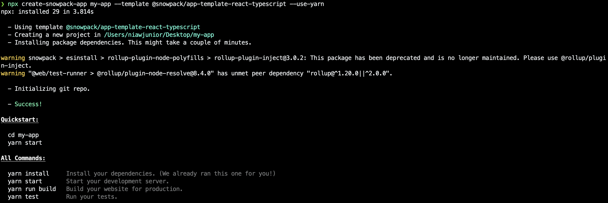
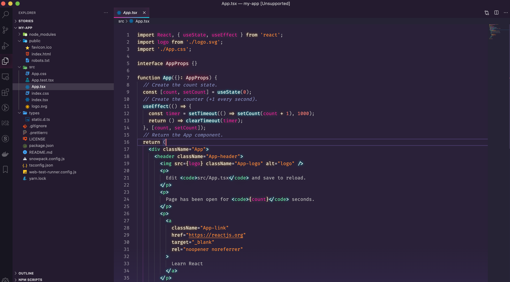
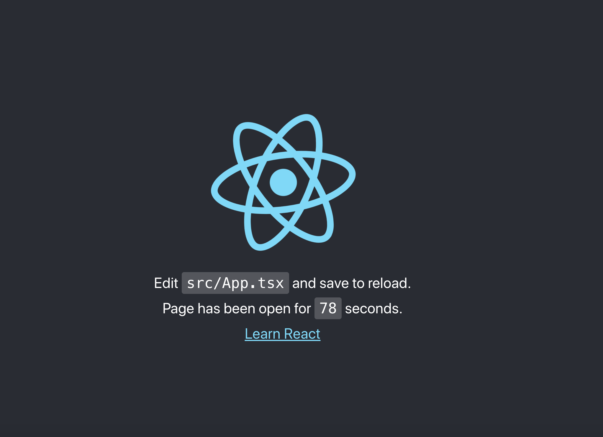

## Snowpack คือ อีหยังวะ?
Snowpack เป็น build tool สำหรับ frontend ตัวใหม่ ที่หลายคนต่างบอกเป็นเสียงเดียวกันว่า โครตเร็ววววส์ และ อาจจะเข้ามาแทน พวก module bundler เก่าๆ อย่าง webpack หรือ Parcel

อะไรคือเหตุผลที่ทำให้ Snowpack เร็ว?

คำตอบคือ Snowpack ใช้ประโยชน์จาก Native module system (ESM) ของ JavaScript ครับ โดยทุกไฟล์ จะมีการ build แค่ครั้งเดียว เท่านั้น แล้วนำไปเก็บไว้ใน cache และครั้งต่อไป ถ้าไฟล์ไหนเกิดการเปลี่ยนแปลง จะทำการ rebuilds แค่ไฟล์นั้นไฟล์เดียวครับ ไม่ได้ build ใหม่ทั้งหมด จากนั้น จะส่งผลลัพธ์ที่ได้ ไปที่ Browser ทันที ซึ่งนี่ จะช่วยให้ประหยัด development time เป็นอย่างมากครับ

ข้อดีอีกอย่างนึงคือ เรายังสามารถใช้ bundler ตัวอื่น ในการ build สำหรับ production  ได้ครับ ซึ่งใน official ของ snowpack เอง ตอนนี้ support webpack แล้ว ส่วน Rollup กำลังอยู่ในช่วงพัฒนา ครับ

## ประโยชน์ หลักๆ

- ช่วยในการ dev ให้เร็วขึ้น เนื่องจากช่วยทำให้ เวลาในการ build ลดลง
- เห็นการเปลี่ยนแปลงที่เกิดขึ้น ใน Browser ได้ทันที
- สามารถ Integrate กับ bundle ตัวอื่นๆ เช่น webpack ได้เหมือนเดิม ในกรณีที่ต้องการ build เป็น production
- support ไฟล์รูปแบบต่างๆ มาให้ตั้งแต่ build-in เลย โดยที่ไม่ต้อง config เพิ่มเติม
  - JavaScript (.js, .mjs)
  - TypeScript (.ts, .tsx)
  - JSX (.jsx, .tsx)
  - CSS (.css)
  - CSS Modules (.module.css)
  - Images (.svg, .jpg, .png, etc.)
- รองรับ plugins ที่ใช้เชื่อมต่อกับ third-party อื่นๆ ได้อีกมากมาย
  - React
  - Preact
  - JSX
  - HTM
  - lit-html
  - Vue
  - Svelte
  - Tailwind CSS
  - Sass
  - อื่นๆ

  
## Browser Support

รองรับ IE11 นะครับ 😂


## สร้างโปรเจคจาก Create Snowpack App (CSA)

``` bash
# ติดตั้งผ่าน npx
npx create-snowpack-app [ชื่อ app] --template [ชื่อ template] [--use-yarn | --use-pnpm | --no-install]

# ติดตั้งผ่าน yarn
yarn create snowpack-app [ชื่อ app] --template [ชื่อ template] [--use-yarn | --use-pnpm | --no-install]
```

ดู Template ที่รองรับได้ที่ <a rel="noreferrer" href="https://github.com/snowpackjs/snowpack/tree/master/create-snowpack-app" target="_blank">Create Snowpack App (CSA)</a>

ในบทความนี้ จะเลือกใช้ template ของ React+TypeScript นะครับ และ ติดตั้งผ่าน npx โดยใช้คำสั่ง

``` bash
npx create-snowpack-app my-app --template @snowpack/app-template-react-typescript --use-yarn
```
ติดตั้งเสร็จแล้ววววว 🥰🥰



ไฟล์ต่างๆที่ติดมากับ template `@snowpack/app-template-react-typescript`



จากนั้น ลองใช้คำสั่ง `yarn start` สำหรับรัน development server ขึ้นมาดูครับ 

> port default คือ http://localhost:8080  นะครับ

แท่น แทน แท๊น




>ก็จบไปแล้วนะครับ สำหรับบทความง่ายๆ เกี่ยวกับ การติดตั้ง React+TypeScript ผ่าน Snowpack ครับ  ~

<div style="max-width:200px;margin:auto">


</div>